# Primitive Immersive Development Environment - User Manual

---

**Primitive is only available to alpha testers who have [signed up for early access on our website](https://primitive.io/). If you'd like access, please sign up. If you're interested in using Primitive as part of a larger organization, please reach out to us at [support@primitive.io](mailto:support@primitive.io).**

---

## Downloading Primitive

If you have access to the alpha program, you can download Primitive via the following distribution platforms:

- [Steam](http://store.steampowered.com/app/777890/Primitive/). Download through Steam if you have an **HTC Vive**, **Oculus Rift** or a **Windows MR headset**. You will need a Steam key.
- Oculus Home. Download through Oculus Home if you have a **GearVR headset**. You will need to be added to the Primitive alpha channel.

## First Impressions

In Primitive, there are two display areas:

1. **The Menu.** Located at head-level, the **menu** displays the name of the Java project being viewed, and also a button for changing projects.

    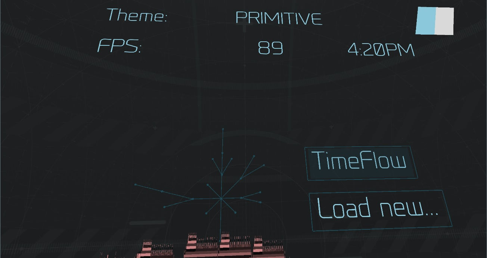

1. **The Model.** Located on the floor, the **model** is a representation of the code in the current project. It is organized into a **directory map**. Each **directory** contains **classes** with source code.

    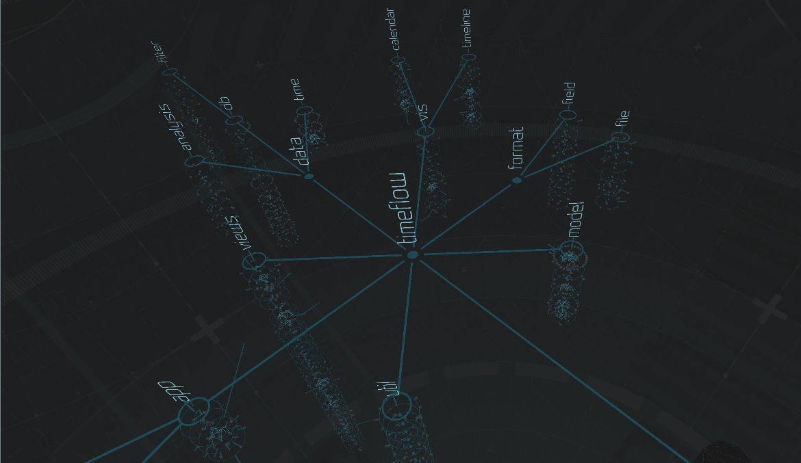

## Controls

### Wands (HTC Vive)

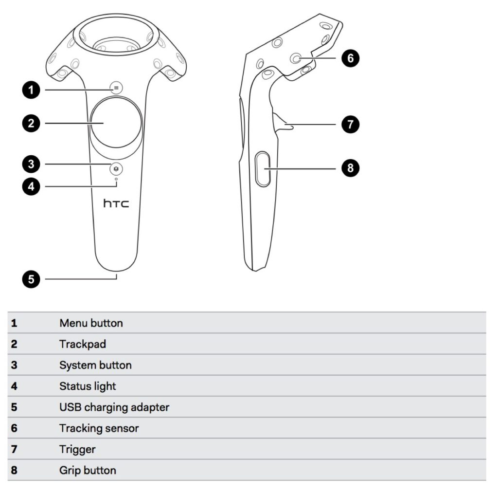

The two wands have different functions in Primitive:

1. The **Exploration Wand**. In the dominant hand, the **exploration wand** is used to make selections and manipulate objects in the world. It features two pincers used to aim at selections. The pincers close when the user points to a selectable object.

    A line comes out of the **exploration wand** which shows the direction the user is pointing in. The line locks on objects that can be selected. The **trigger** can be used to make selections.

1. The **Runtime Wand**. In the other hand, the **runtime wand** is used to view and control the program execution (supported projects only).

### Touch Controllers (Oculus Rift)

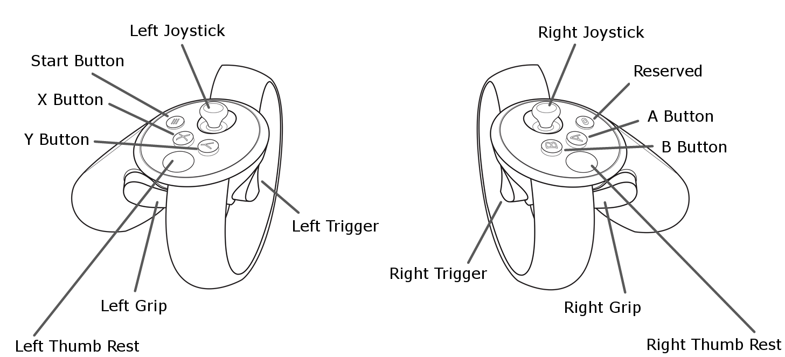

The two controllers have different functions in Primitive:

1. The **Exploration Controller**. In the right hand, the **exploration controller** is used to make selections and manipulate objects in the world.

    A line comes out of the **exploration controller** which shows the direction the user is pointing in. The line locks on objects that can be selected. The **trigger** can be used to make selections.

1. The **Runtime Controller**. In the left hand, the **runtime controller** is used to view and control the program execution (supported projects only).

### GearVR Touchpad (GearVR)

The GearVR headset contains a **touchpad** on the right side of the headset. The touchpad can be swiped, as well as pressed in each direction, up, down, left and right. Above the touchpad is a **back button**.

When looking at a selectable object with the GearVR, the object will indicate it can be interacted with. The object can be selected by tapping the center of the touchpad.

## Selecting a Project

1. Select the **Load new...** button on the menu.

    

1. Point at any of the available projects for more information about that project.

    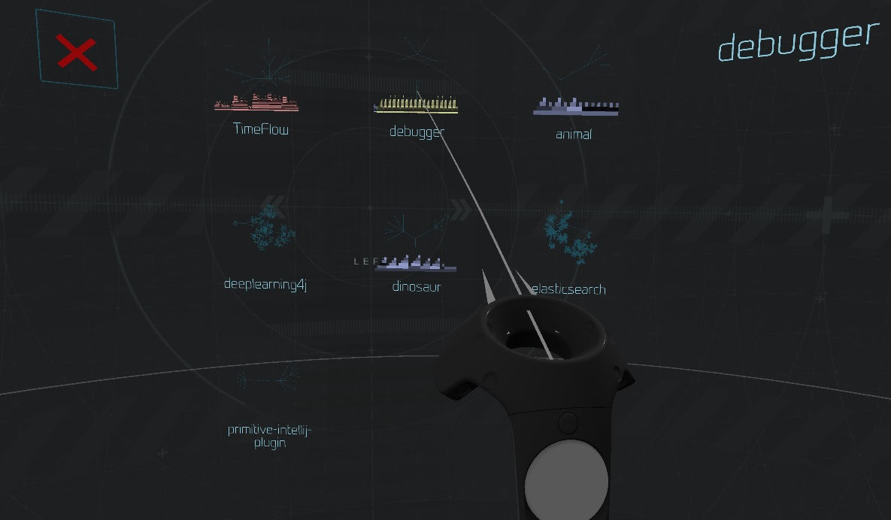

1. Load a project by selecting it.

## Navigating the Project

### Moving the World (Vive and Rift)

1. Aim at an **empty spot** on the ground.

    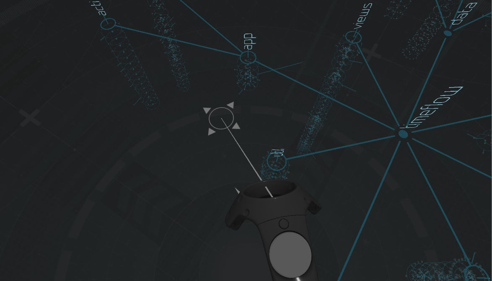

1. Hold down the **trigger** on the **exploration** wand (on Vive) or controller (on Rift), then move the wand or controller to move the world.

1. Release the **trigger** to stop moving the world.

### Opening and Browsing a Directory

1. Aim at a **directory**. Select the directory to open it.

    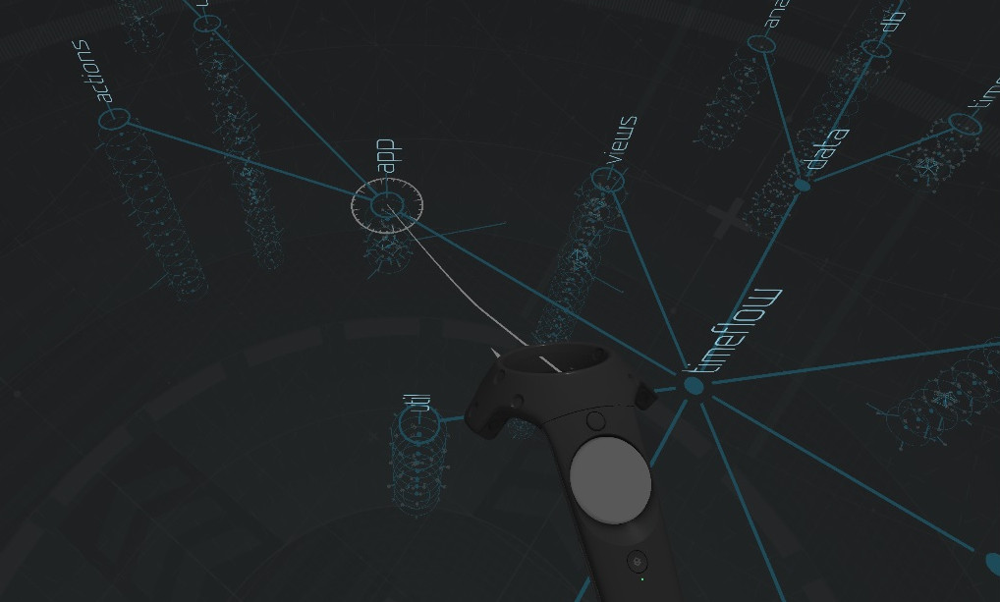

1. The first **class** in the **directory** will be selected and will have an arrow next to it. Scroll through the **classes** with the up and down buttons on the **exploration wand** trackpad (on Vive), by pressing up and down on the **exploration controller** joystick (on Rift), or by swiping up and down on the **GearVR touchpad** (on GearVR).

    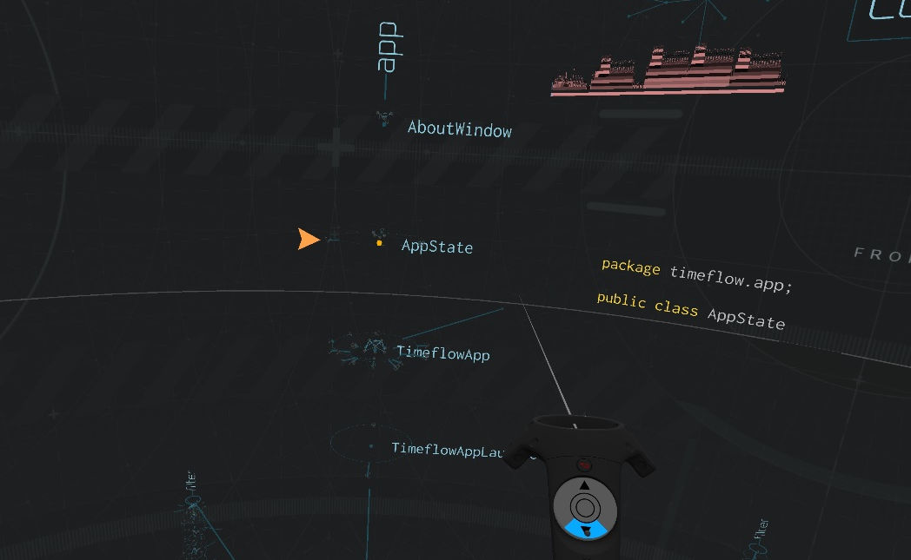

1. Open a class by pressing the center of the **exploration wand** trackpad (on Vive), by pressing the **A button** (on Rift), or tapping on the **GearVR touchpad** (on GearVR). The **methods** and **fields** of the class are now listed.

    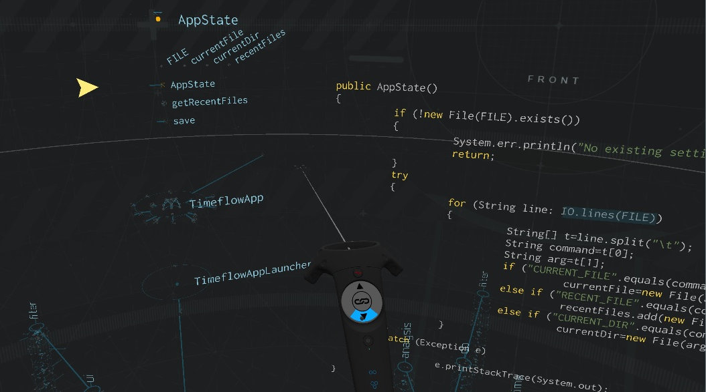

1. The **source code** can be moved up and down by aiming at the source code and dragging the source code with the **trigger** (on Vive and Rift).

### Closing Classes and Directories

1. A **selected class** can be collapsed, thus collapsing its methods and fields, by pressing the **exploration wand** menu button (on Vive), the **B button** (on Rift), or the **back button** (on GearVR).

    Collapsing a class works even when selected on one of its methods or fields.

1. An **open directory** can closed by pointing at the base of the directory, then pressing the **exploration wand** menu button (on Vive), the **B button** (on Rift), or the **back button** (on GearVR).

    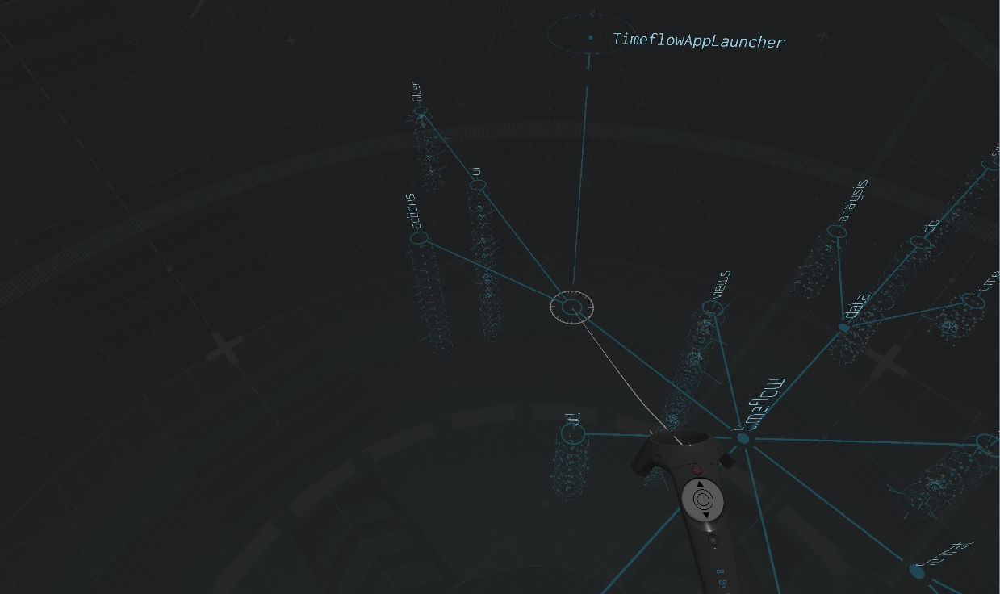

### Viewing Method Calls/Class Extensions

If a method calls out to other methods within the project, the source code for that method will contain **selectable links**. Aim at a link and select it to navigate to the called method.

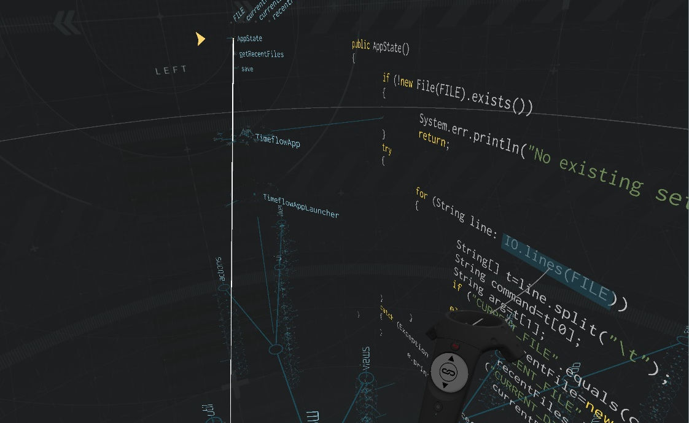

1. While selected on a method or expanded class, press the "link" button on the **exploration wand** trackpad (on Vive) or the **A button** (on Rift) to view the references to and from that method or class. Not all methods and classes have references.

1. A menu will appear next to the method or class showing the different types of references available for that method or class. Press the up and down buttons on the **exploration wand** touch pad (on Vive), press up and down on the **exploration controller** joystick (on Rift) or swipe up and down on the **GearVR touchpad** (GearVR) to select a different type of reference.

    Not all methods and classes have more than one type of reference.

1. When a type of reference is selected, all referenced elements will be highlighted with a glowing particle. For example, when viewing methods called by the currently selected method, the particles are on the methods being called.

    Dimmer particles represent higher-degree references. For example,when viewing methods called by the currently selected method, a dim particle shows that the current method calls a method, which calls another method, which eventually calls the method with the dim particle on it.

    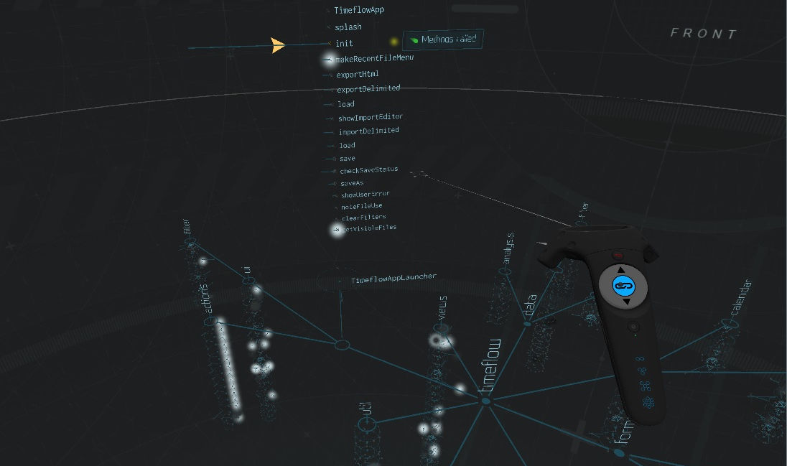

## Viewing the Project Runtime (select projects only)

1. If the current project has a recorded runtime, the runtime can be viewed by pressing the **runtime wand** "play" button (on Vive), the **X button** (on Rift), or the **GearVR** back button (on GearVR).

1. The runtime can be **stepped through** by pressing the "next" button on the right of the **runtime wand** trackpad (on Vive), pressing right on the **runtime controller** joystick (on Rift), or pressing right on the **GearVR touchpad** (on GearVR).

    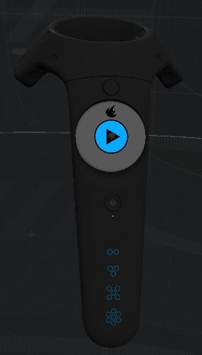 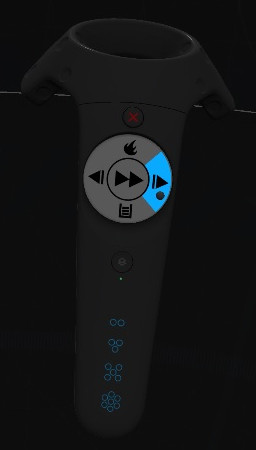

1. The **call stacks** for the entire execution are displayed in the **timeline** underneath the menu. Aim at any point on the timeline and select it to jump to that point in the execution.

    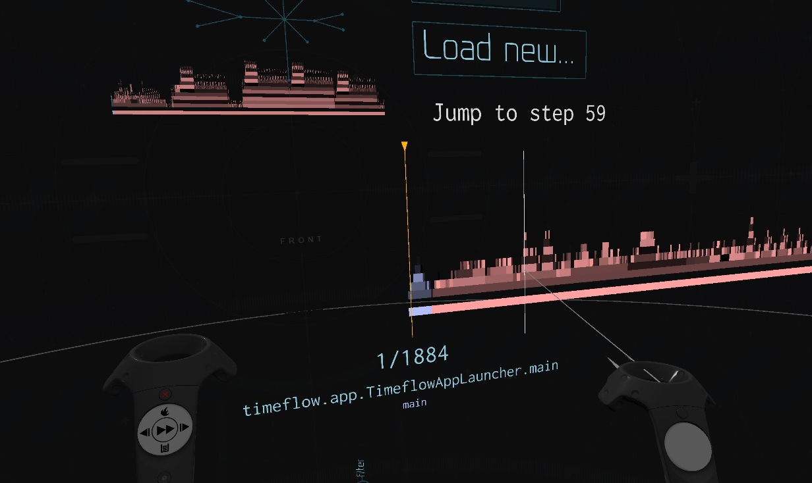

1. The runtime can be toggled in and out of **fast step** mode by pressing the "fast forward" button in the middle of the **runtime wand** trackpad (on Vive), pressing the **X button** (on Rift) or tapping the middle of the **GearVR touchpad** (on GearVR).

### Exiting the Runtime

1. The runtime can be exited by pressing the menu button on the **runtime wand** (on Vive), the **X button** (on Rift), or by selecting the **EXECUTE** button on the menu (on GearVR).

### Runtime Objects

As **objects** are instantiated, they are displayed above the **directory map**. The objects are grouped into a tree that is organized by the order in which the objects were created (the **Factory Model**).

Each **thread** of execution is shown as a brightly colored line. If there are multiple threads executing concurrently, they will be shown in different colors. Each thread connects from method to method depending on the **call stack**.

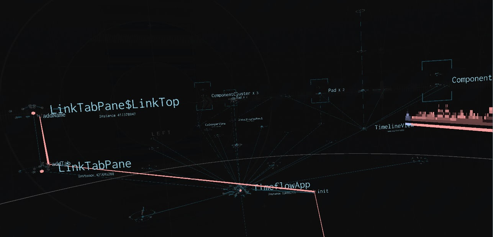

### Viewing Call Stacks

Not all objects in the runtime are active on the currently executing call stacks.

1. To isolate the currently executing call stacks, press the "stack" button on the **runtime wand** trackpad (on Vive), press down on the **runtime controller** joystick (on Rift) or press the down button on the **GearVR touchpad** (on GearVR). This initiates the **Call Stack Mode**.

    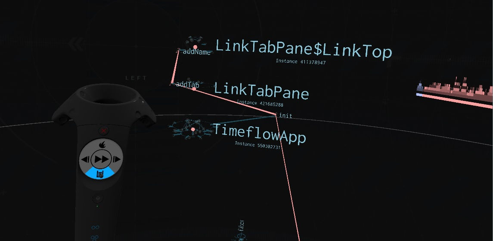

1. To view the source code of methods on one of the call stacks, aim at the call stack and select it. The lowest method will be selected and the source code will be visible.

    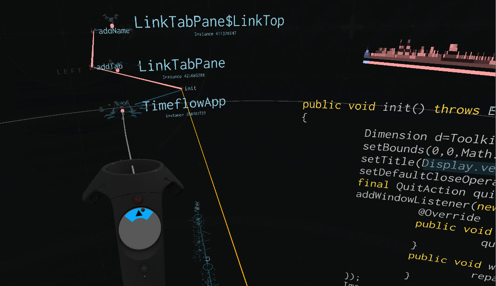

1. Scroll through the methods on the call stack by pressing up and down on the **exploration wand** trackpad (on Vive), by pressing up and down on the **exploration controller** joystick (on Rift), or by swiping up and down on the **GearVR touchpad** (on GearVR).

### Viewing the Method Call Heatmap

If a project has a recorded runtime, then it's possible to see how many times each method in the project was called. *When not in runtime mode*, press the "heatmap" button on the **runtime wand** trackpad (on Vive) or press up on the **runtime controller** joystick (on Rift).

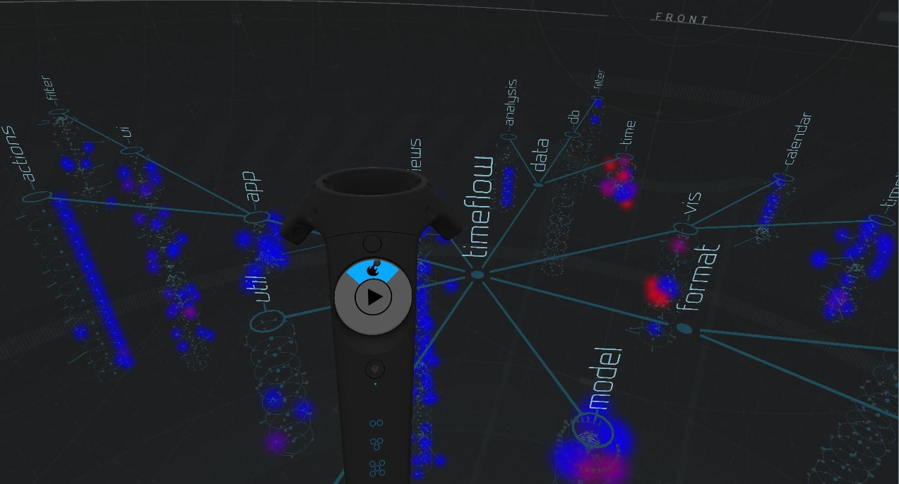

Methods with **red** particles on them are called the most number of times relative to other methods in the project. Methods with **blue** particles are not called as many times.

Method call counts are applicable for the recorded runtime associated with the project.
