# Primitive — Holographic Agent Control

Step inside your software. Primitive brings code structure, runtime behavior, and coding agents into a shared 3D workspace in VR, mixed reality, or on a screen. Point at a method, give Claude Code or Codex direction, and inspect the code they change.

[Explore Primitive](https://primitive.io/) · [Request a demo or developer access](https://primitive.io/join/) · [Proxy documentation (access required)](https://github.com/PRIMITIVE-IO/primitive-proxy) · [Unity viewer (access required)](https://github.com/PRIMITIVE-IO/primitive-env/tree/main/Assets/PrimitiveViewer)

**This guide covers the current developer build.** It requires access to the proxy and viewer repositories; this repository is the public instruction page. Those repositories are not currently publicly accessible: request developer access before following the clone instructions. Earlier Steam, Viveport, and SideQuest releases are the legacy immersive development environment, and do not provide the agent workspace described here. Their original manual is preserved at the end.

## What you can do

| Capability | In the workspace |
| --- | --- |
| Direct coding agents | Start installed Claude Code or Codex in a project; speak or type with selection and pointing context; follow agent highlights and narration. |
| Understand code | Explore radial maps of directories, files, classes, methods, and fields; inspect method-level changes against Git HEAD. |
| Follow execution | Play recorded workflows, step through call stacks, and inspect captured object and data changes. Capture detail varies by tracer. |
| Connect locations | See the PC, phone, server, and headset as islands, with requests between them; connect other proxy machines. |
| Inspect graphs | Open Blueprint-style class graphs or the flow of a recorded call, with typed pins and data wires. |
| Keep outputs nearby | Bring the agent test browser, monitors, windows, and an attached Android phone into VR as screen panels. |
| Work together | Connect VR, desktop, and browser viewers to share the world, playback position, highlights, and agents. |

## Start on a desktop

Prerequisites: granted repository access, Git, and the .NET 10 SDK. Authenticate GitHub with the account that has access. Python 3.9+ is needed to record Python traces, but the demo already includes recordings. For agents, install and authenticate Claude Code and/or Codex on the machine running the proxy.

After access is granted, clone and start the proxy:

```powershell
git clone https://github.com/PRIMITIVE-IO/primitive-proxy.git
cd primitive-proxy
dotnet run --project src/Primitive.Proxy -- --demo
```

Open [localhost:7420](http://localhost:7420/) for the browser viewer. The demo includes five sample workflows: ETL, a phone/API/SQLite flow, a state store, a threaded queue, and a headset game loop.

For the full desktop or VR viewer, clone [primitive-env](https://github.com/PRIMITIVE-IO/primitive-env) and open it in the Unity version recorded in its `ProjectSettings/ProjectVersion.txt`. In Unity select **Primitive → Open Viewer Scene**, then **Play**, while the proxy is running. With an OpenXR headset connected it starts in VR; otherwise it runs on a flat screen.

## Bring your own code

Run from the proxy repository, replacing the example path:

```powershell
dotnet run --project src/Primitive.Proxy -- --root C:\code\my-app
```

`--root` is repeatable. Source structure is analyzed with tree-sitter for C#, Python, TypeScript/TSX, JavaScript, Java, Go, Rust, C, C++, Ruby, PHP, Scala, and Bash. Files are watched and compared against Git HEAD at method level.

Use `--fs C:\path\to\workspace` to map a folder tree and discover projects, or `--analyses C:\path\to\analyses` to load legacy FileParser databases. The proxy README explains analysis caching, language support, and optional FileParser setup.

## Direct an agent

1. Open a project and select an element you want to work on.
2. Use **Start Claude here** / **Start Codex here** on a project pad, or **+ Claude** / **+ Codex** in the viewer menu.
3. Press **Enter** to type, or hold **V** to speak on the desktop. On Quest, hold a right thumb–middle-finger pinch, speak, then release.
4. Try “claude, explain this method” or “codex, add a test for this.” The agent receives your selection and pointing context.
5. Ask “explain the changes” to walk through the diff with highlights.

The optional voice assistant needs an OpenAI key file configured on the proxy:

```powershell
dotnet run --project src/Primitive.Proxy -- --root C:\code\my-app --openai-key-file C:\secrets\openai-key.txt
```

The key is read by the proxy and is not sent to viewers. Without it, supported command phrases route navigation, playback, and named agent requests; voice transcription depends on the viewer or configured speech-to-text tool.

Supported permission requests appear as notices and can be answered with **Approve / Deny** or by voice. Approval behavior depends on the agent integration: the current Codex bridge uses workspace-write with approval policy set to never. Do not assume every agent action produces a prompt. Review the proxy documentation and your provider settings before connecting private code.

## Quest 3: standalone VR and passthrough

The developer viewer supports Quest hand tracking and passthrough. Building and sideloading requires Unity Android build support, a headset in developer mode, and Android platform tools.

1. Start the proxy with `--lan` (add `--root` or `--demo` and optional voice configuration):

   ```powershell
   dotnet run --project src/Primitive.Proxy -- --demo --lan
   ```

2. In the Unity viewer project select **Primitive → Quest → Build**. Keep the proxy running so the build can fetch its local pairing. The output is `Builds/Quest/Primitive.apk`.
3. Connect the Quest by USB, allow USB debugging, and run these commands from the viewer repository:

   ```powershell
   adb install -r Builds/Quest/Primitive.apk
   adb reverse tcp:7420 tcp:7420
   adb shell am start -n com.primitive.viewer/com.unity3d.player.UnityPlayerGameActivity
   ```

USB reverse connects the headset to the proxy without a network route. Unplugged, the paired build uses the LAN addresses. Allow the proxy on your private network when prompted, and keep the PC and headset on the same network. See the [viewer README (access required)](https://github.com/PRIMITIVE-IO/primitive-env/tree/main/Assets/PrimitiveViewer) for pairing, gesture details, and troubleshooting.

## Essential controls

| Action | Full desktop viewer | Quest hands |
| --- | --- | --- |
| Select | Click | Right thumb + index tap |
| Move around | WASD / Q / E; right-drag to look | Left thumb + index, hold and move the world |
| Scale / turn the world | Mouse wheel dollies the camera | Both thumbs + index, hold |
| Talk | Enter to type; hold V to speak | Right thumb + middle, hold; release to send |
| Open a graph | G | Right thumb + ring |
| Play / pause | Space | Left thumb + ring |
| Step through a trace | Left / right arrows | Playback controls in the menu |
| Back / clear selection | Esc | Left thumb + middle |
| Open the menu | Desktop HUD | Left palm toward you, thumb + index |

Browser controls differ from the full Unity desktop viewer. For the complete controls, panel gestures, and selection behavior, use the viewer README.

## Record and inspect runtime behavior

The demo traces work immediately. For your own Python workflow, from the proxy repository:

```powershell
$env:PYTHONPATH = "tracers/python"
python -m primitive_trace --workflow checkout --location-kind server C:\code\my-app\app.py
```

Traces are written into the workflow root’s `.primitive/traces/` folder and picked up by the proxy watching that root. Python capture includes calls, arguments, return values, object creation, field/container mutations, locals, and SQLite/file/HTTP I/O. See the [Python tracer guide (access required)](https://github.com/PRIMITIVE-IO/primitive-proxy/tree/main/tracers/python) for capture setup.

Other services can send OTLP/HTTP JSON spans to `http://localhost:7420/v1/traces`. These provide span-level behavior rather than Python’s full mutation capture. Companion .NET and Unity tracing tools and a legacy trace converter are documented in their product repositories.

## Screens and shared sessions

Say “show me the browser,” “open localhost 3000,” or “show my phone” to bring outputs into view. The agent test browser uses an isolated profile: use it for app testing, and avoid signing into real accounts. Physical monitor/window control is off by default and requires proxy configuration plus **Allow control** on the panel.

For additional viewers, start the proxy with `--lan` and follow its token pairing instructions. Shared viewers see the same world, highlights, playback, and agents. To connect another machine, follow **Network: more machines** in the proxy README; keep tokens in files and use TLS for public connections.

## If something is missing

- **No world:** confirm the proxy is running, try the browser viewer locally, and check the Unity viewer connection.
- **Agent cannot start:** confirm its CLI is installed and authenticated on the proxy machine. The proxy accepts `--claude` / `--codex` paths when discovery fails.
- **No runtime:** source analysis alone does not record execution. Load demo traces or capture a workflow using a supported tracer.
- **Quest cannot connect:** rebuild with the proxy running, check USB debugging and `adb reverse`, then consult pairing instructions before switching to LAN.

Want a guided walkthrough or to explore a team pilot? [Request a conversation](https://primitive.io/join/) or email [john@primitive.io](mailto:john@primitive.io).

---

<details>
<summary>Legacy release manual — Vive, Rift, and GearVR</summary>

# Primitive Immersive Development Environment — Legacy User Manual

---

**Primitive is available on [Viveport](https://www.viveport.com/apps/675c92c6-7df2-4ee3-b919-1bfbb6e5e8cc/Primitive/) and [Steam](https://store.steampowered.com/app/777890/Primitive/) for non-commercial use. If you're interested in using Primitive as part of a larger organization, please reach out to us at [support@primitive.io](mailto:support@primitive.io).**

---


## View your own repo (free for non-commercial use)

In the `environment.yaml` file in  
Steam Installation: `C:\Program Files (x86)\Steam\steamapps\common\Primitive\PRIMITIVE_Data\StreamingAssets`  
Viveport Installation: `C:\...\675c92c6-7df2-4ee3-b919-1bfbb6e5e8cc\...\Primitive\PRIMITIVE_Data\StreamingAssets`  

edit  
```
localDirectories:
  directories:
     - C:\path\to\my\repo1
     - C:\path\to\my\repo2
```

Your folders containing files and source code will now be visible on the "Local" browser sphere.  

## First Impressions

In Primitive, there is a nested sphere containing analyses. Selecting an analysis will "land" you on the analysis.  

Select the `Return` button to return to the global view.  

## Controls

### Wands (HTC Vive)

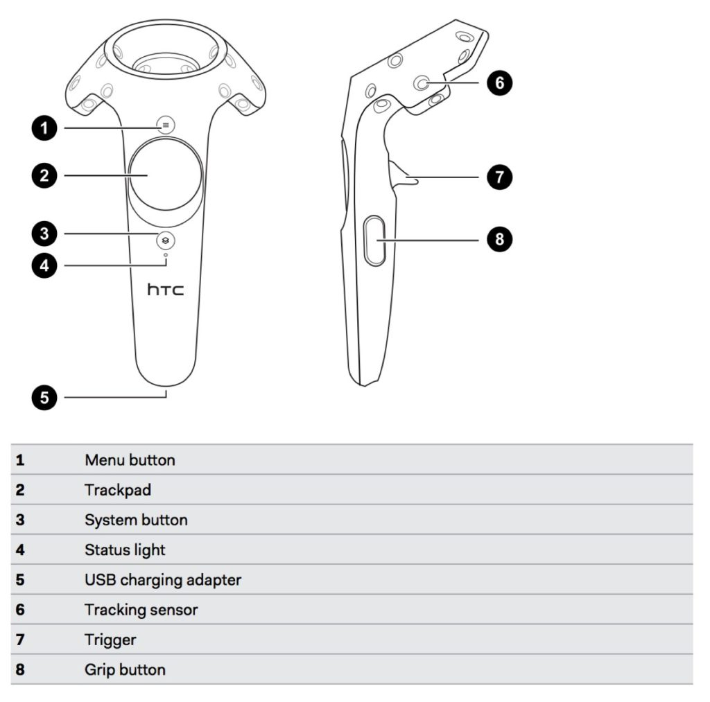

The two wands have different functions in Primitive:

1. The **Exploration Wand**. In the dominant hand, the **exploration wand** is used to make selections and manipulate objects in the world. It features two pincers used to aim at selections. The pincers close when the user points to a selectable object.

    A line comes out of the **exploration wand** which shows the direction the user is pointing in. The line locks on objects that can be selected. The **trigger** can be used to make selections.

1. The **Runtime Wand**. In the other hand, the **runtime wand** is used to view and control the program execution (supported projects only).

### Touch Controllers (Oculus Rift)

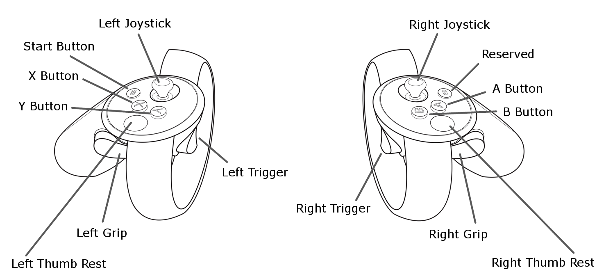

The two controllers have different functions in Primitive:

1. The **Exploration Controller**. In the right hand, the **exploration controller** is used to make selections and manipulate objects in the world.

    A line comes out of the **exploration controller** which shows the direction the user is pointing in. The line locks on objects that can be selected. The **trigger** can be used to make selections.

1. The **Runtime Controller**. In the left hand, the **runtime controller** is used to view and control the program execution (supported projects only).

### GearVR Touchpad (GearVR)

The GearVR headset contains a **touchpad** on the right side of the headset. The touchpad can be swiped, as well as pressed in each direction, up, down, left and right. Above the touchpad is a **back button**.

When looking at a selectable object with the GearVR, the object will indicate it can be interacted with. The object can be selected by tapping the center of the touchpad.

### GearVR Controller (GearVR)

The GearVR Controller has the combined functions of the **exploration controller** and the **runtime controller** integrated together. The **trigger** is used for selection, the **touchpad** is used for scrolling and stepping, and the **back button** is used for escaping.

## Selecting a Project

1. Select the **Load new...** button on the menu.

    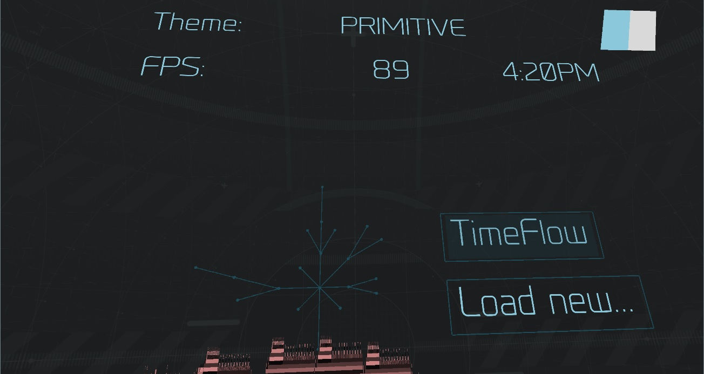

1. Point at any of the available projects for more information about that project.

    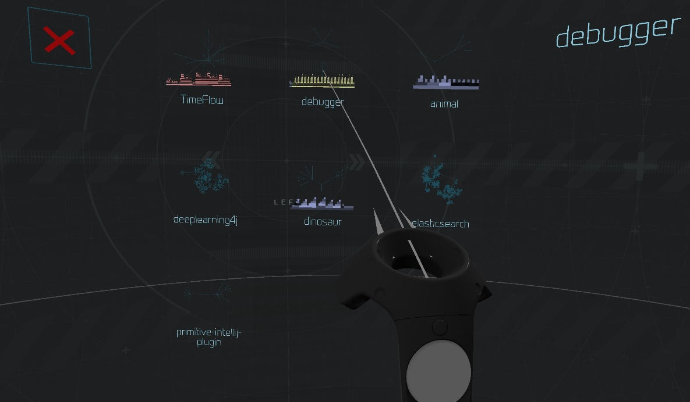

1. Load a project by selecting it.

## Navigating the Project

### Moving the World

#### With Controllers

1. Aim at an **empty spot** on the ground.

    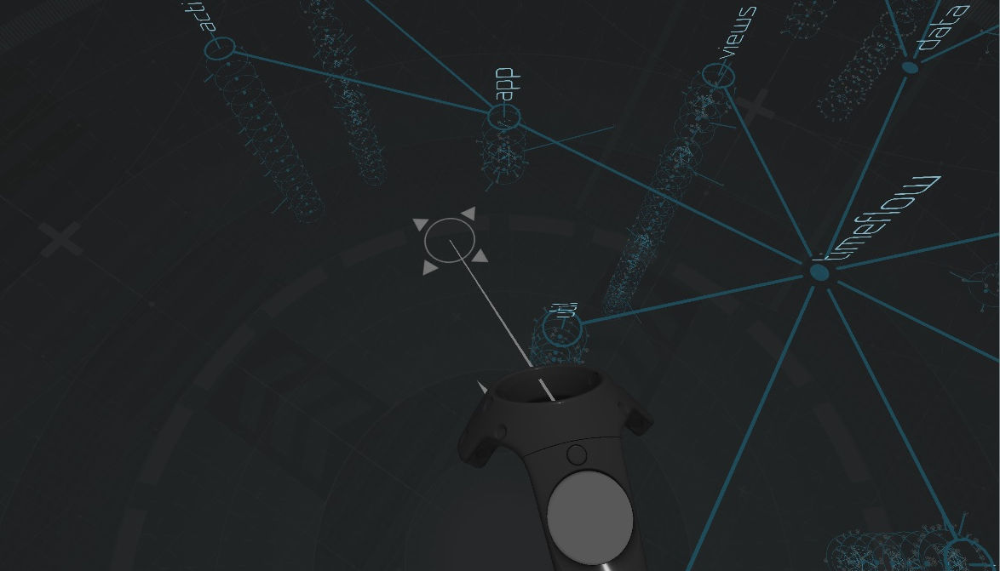

1. Hold down the **trigger** on the **exploration** wand (on Vive) or controller (on Rift or GearVR Controller), then move the wand or controller to move the world.

1. Release the **trigger** to stop moving the world.

#### GearVR without Controllers

1. Holding down the GearVR touchpad for 3 seconds will allow the user to teleport to the point that they are looking at on the ground.

### Opening and Browsing a Directory

1. Aim at a **directory**. Select the directory to open it.

    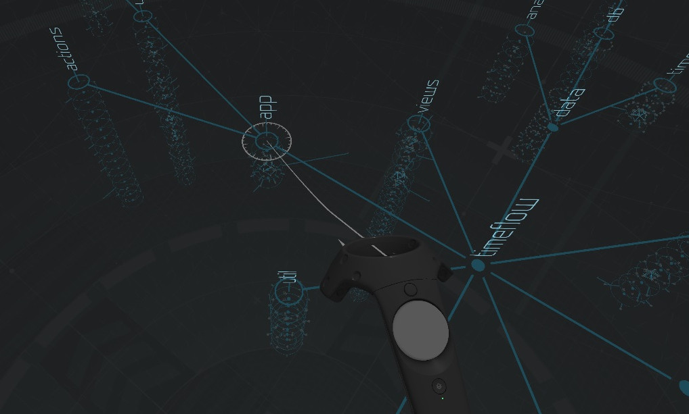

1. The first **class** in the **directory** will be selected and will have an arrow next to it. Scroll through the **classes** with the up and down buttons on the **exploration wand** trackpad (on Vive or GearVR Controller), by pressing up and down on the **exploration controller** joystick (on Rift), or by swiping up and down on the **GearVR touchpad** (on GearVR).

    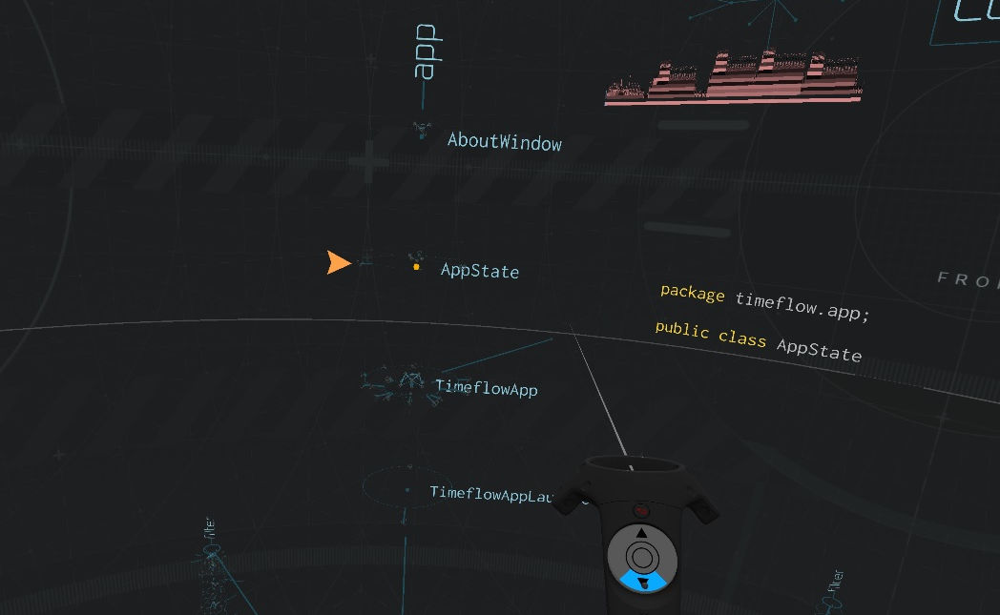

1. Open a class by pressing the center of the **exploration wand** trackpad (on Vive or GearVR Controller), by pressing the **A button** (on Rift), or tapping on the **GearVR touchpad** (on GearVR). The **methods** and **fields** of the class are now listed.

    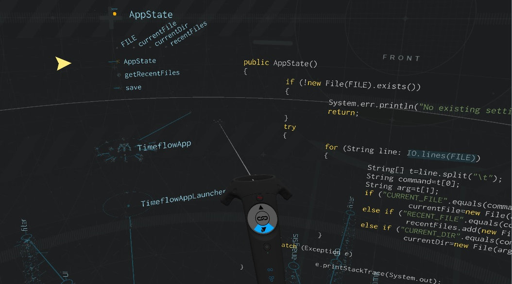

1. The **source code** can be moved up and down by aiming at the source code and dragging the source code with the **trigger** (on Vive, Rift, and GearVR Controller).

### Closing Classes and Directories

1. A **selected class** can be collapsed, thus collapsing its methods and fields, by pressing the **exploration wand** menu button (on Vive), the **B button** (on Rift), or the **back button** (on GearVR).

    Collapsing a class works even when selected on one of its methods or fields.

1. An **open directory** can closed by pointing at the base of the directory, then pressing the **exploration wand** menu button (on Vive), the **B button** (on Rift), or the **back button** (on GearVR).

    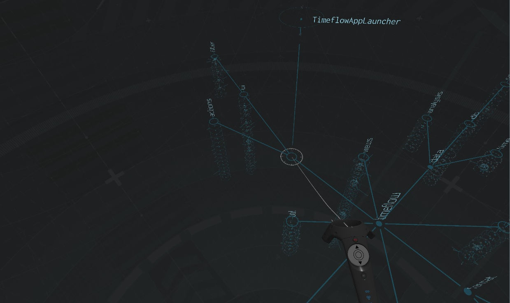

### Viewing Method Calls/Class Extensions

If a method calls out to other methods within the project, the source code for that method will contain **selectable links**. Aim at a link and select it to navigate to the called method.

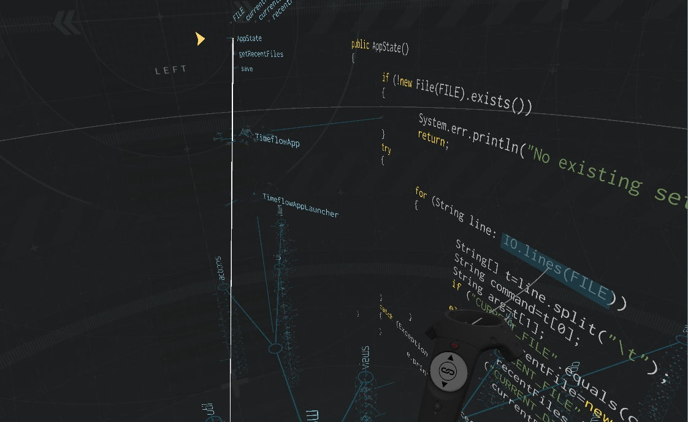

1. While selected on a method or expanded class, press the "link" button on the **exploration wand** trackpad (on Vive or GearVR Controller) or the **A button** (on Rift) to view the references to and from that method or class. Not all methods and classes have references.

1. A menu will appear next to the method or class showing the different types of references available for that method or class. Press the up and down buttons on the **exploration wand** touch pad (on Vive or GearVR Controller), press up and down on the **exploration controller** joystick (on Rift) or swipe up and down on the **GearVR touchpad** (GearVR) to select a different type of reference.

    Not all methods and classes have more than one type of reference.

1. When a type of reference is selected, all referenced elements will be highlighted with a glowing particle. For example, when viewing methods called by the currently selected method, the particles are on the methods being called.

    Dimmer particles represent higher-degree references. For example,when viewing methods called by the currently selected method, a dim particle shows that the current method calls a method, which calls another method, which eventually calls the method with the dim particle on it.

    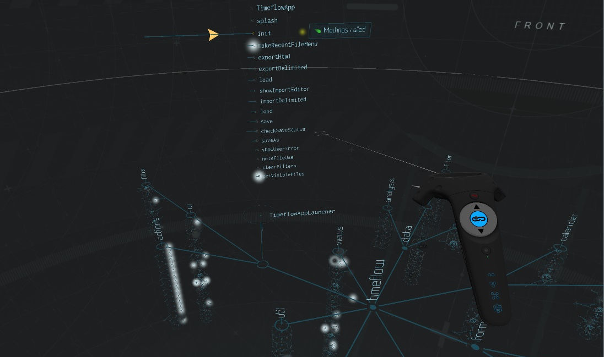

## Viewing the Project Runtime (select projects only)

1. If the current project has a recorded runtime, the runtime can be viewed by finding and selecting the "EXECUTE" handle on a launcher class in the model.

1. The runtime can be **stepped through** by pressing the "next" button on the right of the **runtime wand** trackpad (on Vive), pressing right on the **runtime controller** joystick (on Rift), or pressing right on the **GearVR touchpad** (on GearVR).

    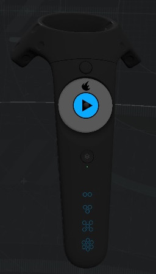 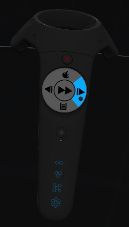

1. The **call stacks** for the entire execution are displayed in the **timeline** underneath the menu. Aim at any point on the timeline and select it to jump to that point in the execution.

    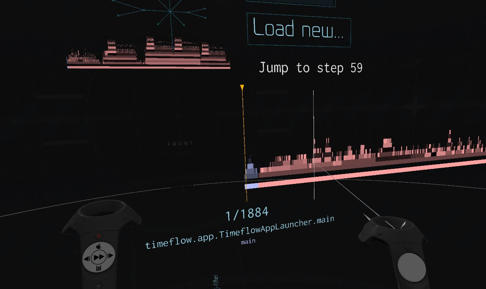

1. The runtime can be toggled in and out of **fast step** mode by pressing the "fast forward" button in the middle of the **runtime wand** trackpad (on Vive or GearVR Controller), pressing the **X button** (on Rift) or tapping the middle of the **GearVR touchpad** (on GearVR).

### Exiting the Runtime

1. The runtime can be exited by pressing the menu button on the **runtime wand** (on Vive), the **X button** (on Rift), the **back button** or by selecting the **EXECUTE** button on the menu (on GearVR).

### Runtime Objects

As **objects** are instantiated, they are displayed above the **directory map**. The objects are grouped into a tree that is organized by the order in which the objects were created (the **Factory Model**).

Each **thread** of execution is shown as a brightly colored line. If there are multiple threads executing concurrently, they will be shown in different colors. Each thread connects from method to method depending on the **call stack**.

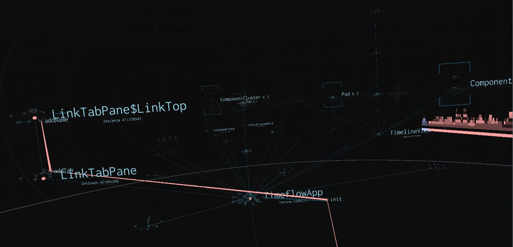

### Viewing Call Stacks

Not all objects in the runtime are active on the currently executing call stacks.

1. To isolate the currently executing call stacks, press the "stack" button on the **runtime wand** trackpad (on Vive), press down on the **runtime controller** joystick (on Rift) or press the down button on the **GearVR touchpad** (on GearVR). This initiates the **Call Stack Mode**.

    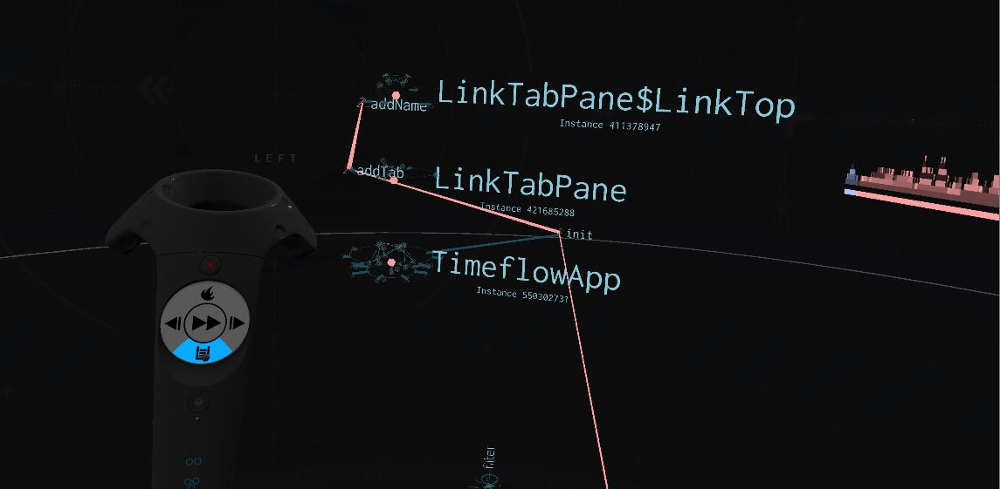

1. To view the source code of methods on one of the call stacks, aim at the call stack and select an object on the stack. The lowest method on the object will be selected and the source code will be visible.

    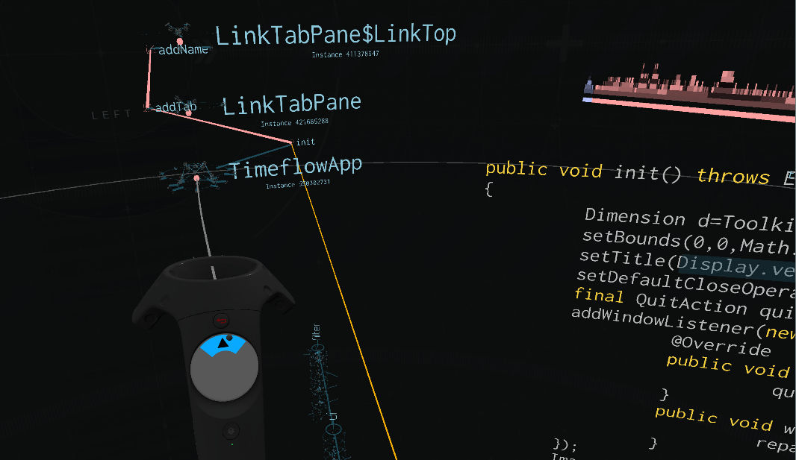

1. Scroll through the methods on the call stack by pressing up and down on the **exploration wand** trackpad (on Vive), by pressing up and down on the **exploration controller** joystick (on Rift).

### Setting Breakpoints

It is possible to set a breakpoint on individual methods.

1. *When not in runtime mode*, navigate to a method.

1. Press the left button on the **exploration wand** trackpad (on Vive), press left on the **exploration controller** joystick (on Rift) or press the left button on the **GearVR touchpad** (on GearVR). This sets a breakpoint on that method, and the icon next to the method turns red.

    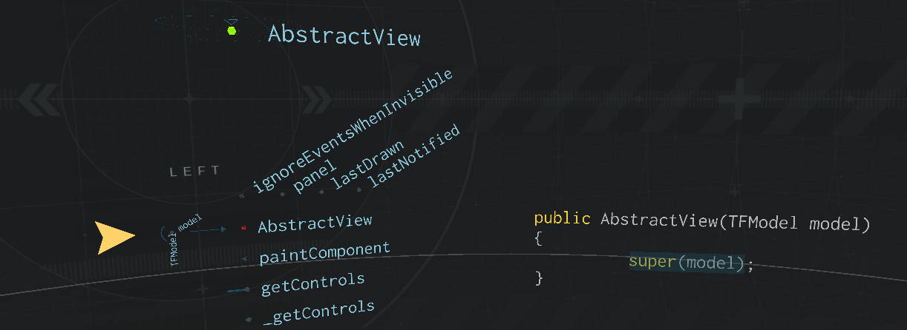

    To remove the breakpoint, press the right button on the **exploration wand** trackpad (on Vive), press right on the **exploration controller** joystick (on Rift) or press the right button on the **GearVR touchpad** (on GearVR).

1. Switch to runtime mode. The execution timeline will now show red lines at all points in the execution where the methods with breakpoints are executed. If no lines appear, the methods with breakpoints are not executed in the particular recording being shown.

   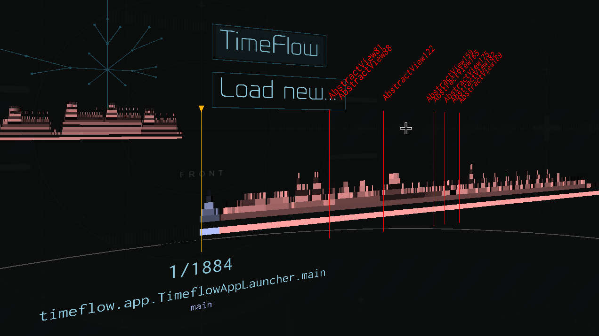

1. To jump to one of the points in time when a breakpointed method is executed, aim at one of the red lines and select the line.

### Viewing the Method Call Heatmap

If a project has a recorded runtime, then it's possible to see how many times each method in the project was called. *When not in runtime mode*, press the "heatmap" button on the **runtime wand** trackpad (on Vive) or press up on the **runtime controller** joystick (on Rift).

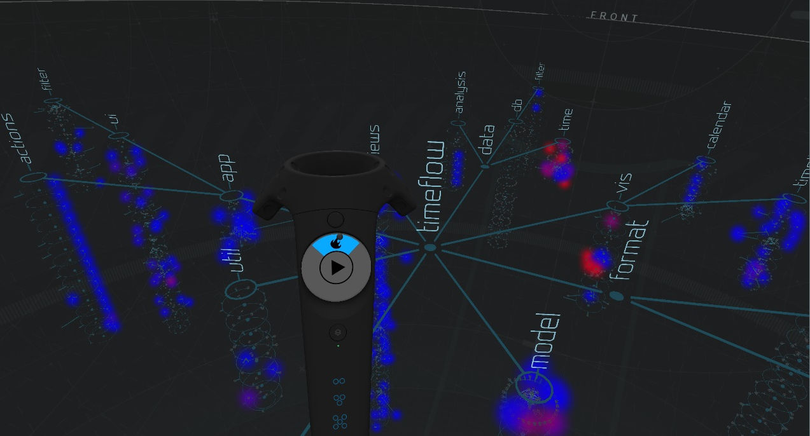

Methods with **red** particles on them are called the most number of times relative to other methods in the project. Methods with **blue** particles are not called as many times.

Method call counts are applicable for the recorded runtime associated with the project.

</details>
